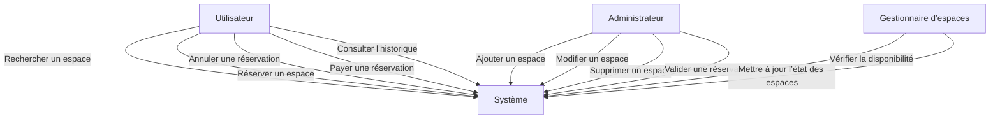
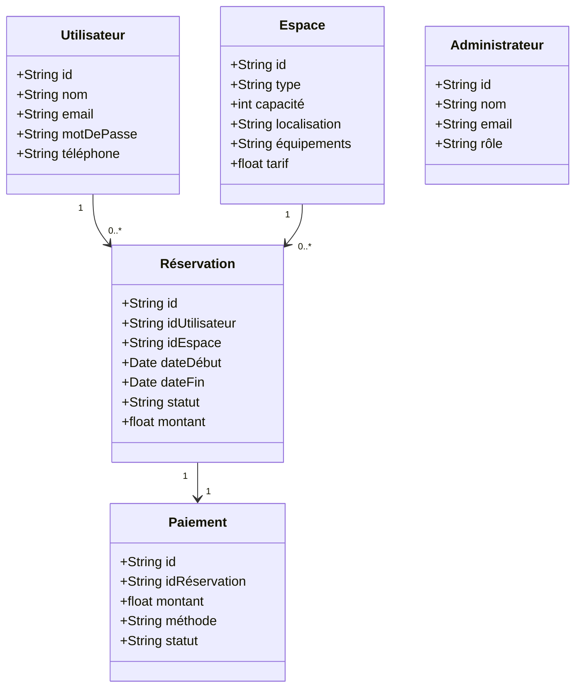
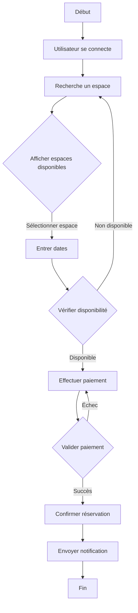
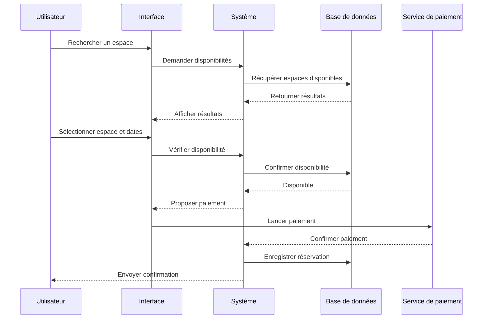
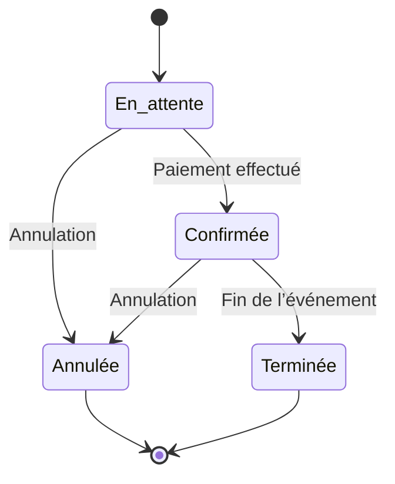
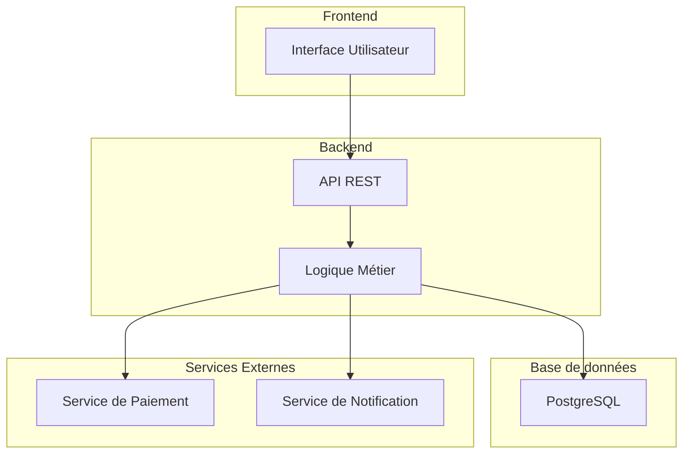
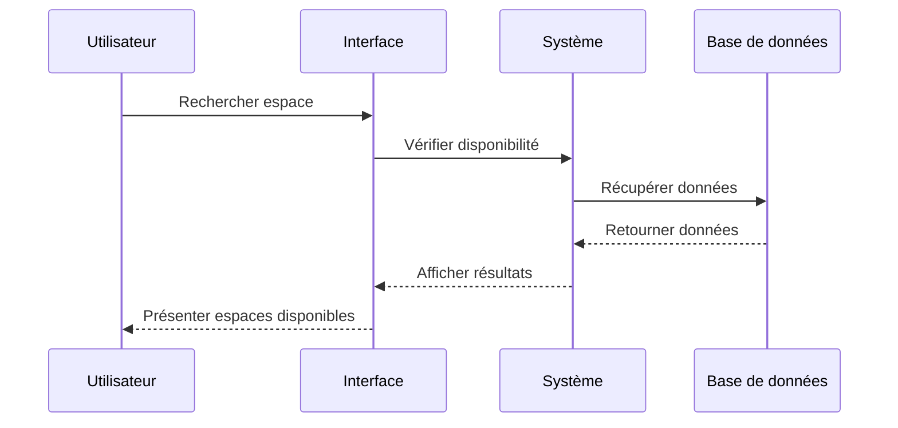

### diagramme de sequence

## diagramme d'etat

## diagramme de composants

## diagramme de deploiement
```mermaid
deploymentDiagram
    device "Client" {
        artifact "Navigateur Web"
    }
    device "Serveur d’application" {
        artifact "Node.js/Express"
    }
    device "Serveur de base de données" {
        artifact "PostgreSQL"
    }
    device "Services Externes" {
        artifact "Stripe/Twilio"
    }
    "Navigateur Web" --> "Node.js/Express" : HTTPS
    "Node.js/Express" --> "PostgreSQL" : Connexion sécurisée
    "Node.js/Express" --> "Stripe/Twilio" : API
```
## diagramme de communication

